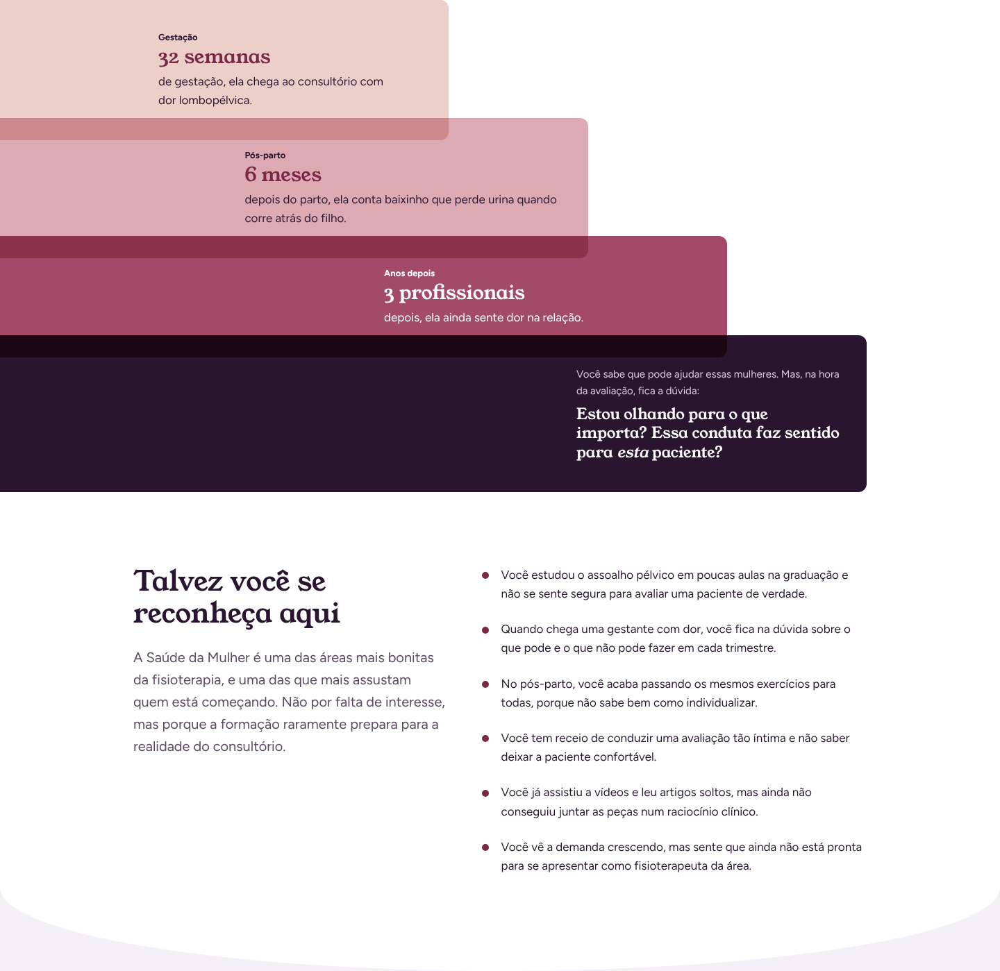
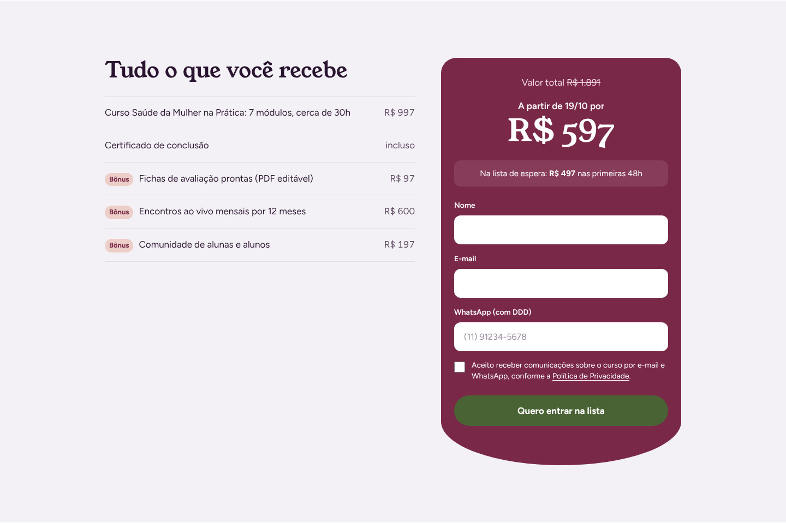

# Saúde da Mulher na Prática · Landing page de lançamento

Landing page de pré-lançamento e vendas para um curso online de fisioterapia em Saúde da Mulher e Obstetrícia, vendido pela Hotmart.

> **Projeto conceitual de portfólio.** A instrutora, o curso, os números e os depoimentos são fictícios. O briefing simula um pedido real publicado em uma plataforma de freelas.

**[Ver o site no ar →](https://saudedamulher.vercel.app/)**


---

## O que a página faz

- **Três fases em uma página:** pré-lançamento (lista de espera), carrinho aberto (vendas) e encerrado. A troca é automática pelas datas do `config.js`, com contador regressivo.
- **Lista de espera no Google Sheets:** o formulário valida os campos, aplica máscara no WhatsApp, tem proteção anti-spam e envia os dados com a origem da visita (UTMs) para uma planilha, via Google Apps Script.
- **Integração com a Hotmart:** o botão de compra abre o checkout já preenchido com nome, e-mail e telefone de quem entrou na lista, e leva a origem da visita (`src`, `sck` e UTMs).
- **Pronta para tráfego pago:** pixels da Meta e do Google Ads (ativados só com o ID no `config.js`), com os eventos `PageView`, `Lead` e `InitiateCheckout`, que permitem criar o público "virou lead e não comprou".
- **Modo portfólio:** a página simula o calendário para nunca mostrar o contador zerado, e um seletor permite ver as três fases.

## Prints

| Desktop | Celular |
|---|---|
|  |  |
|  |  |
|  |  |

[Página inteira no desktop](docs/prints/desktop-completo.jpg)

## Tecnologias

- **HTML, CSS e JavaScript puros**, sem frameworks nem bibliotecas
- **Google Apps Script** + Google Sheets para a lista de espera
- **Vercel** para a hospedagem, com publicação automática a cada atualização no GitHub

## Qualidade

| Lighthouse | Celular | Desktop |
|---|---|---|
| Desempenho | 97 | 100 |
| Acessibilidade | 100 | 100 |
| Boas práticas | 96* | 96* |
| SEO | 100 | 100 |

\* Medido em ambiente de teste com o Google Fonts bloqueado.

- **Acessibilidade:** zero problemas no [axe](https://www.deque.com/axe/) (WCAG 2.2 AA) nas três fases. Inclui link "pular para o conteúdo", foco visível no teclado, contraste AA, regiões para leitores de tela e botão para pausar os depoimentos automáticos.
- **Movimento reduzido:** quem ativa "reduzir movimento" no sistema vê só transições de esmaecer, sem deslocamentos.
- **Melhoria progressiva:** sem JavaScript, todo o conteúdo aparece. Os acordeões são `<details>` nativos e as animações só escondem conteúdo quando o script carrega.
- **Desempenho:** imagens em WebP com `srcset` (três tamanhos), fontes carregadas sem bloquear a página, mobile-first e testado de 320px a 1920px.
- **SEO:** metadados, Open Graph, dados estruturados `Course` (schema.org), `sitemap.xml` e `robots.txt`.

## Estrutura

```
├── index.html                  landing page
├── obrigado.html               página após a inscrição
├── politica-de-privacidade.html
├── css/
│   ├── reset.css
│   ├── variables.css           cores, fontes e espaçamentos (design tokens)
│   └── style.css
├── js/
│   ├── config.js               ← painel de controle: datas, preços, links
│   ├── utils.js                funções compartilhadas
│   ├── fase.js                 fase da página e seletor
│   ├── countdown.js            contador regressivo
│   ├── form.js                 formulário da lista de espera
│   ├── checkout.js             links da Hotmart
│   ├── tracking.js             pixels
│   ├── revelar.js / trajeto.js animações de rolagem
│   ├── acordeao.js             acordeões suaves
│   ├── depoimentos.js          depoimentos automáticos
│   └── main.js                 barra fixa e WhatsApp
├── integracoes/google-sheets/Codigo.gs   script da planilha
└── docs/                       briefing, copy, identidade visual, guias e prints
```

## Como configurar

Tudo o que muda de um lançamento para outro fica em **`js/config.js`**: datas, preços, links do checkout, WhatsApp, planilha e pixels. Não é preciso mexer no HTML.

```js
datas: {
  carrinhoAbre:  "2026-11-03T20:00:00-03:00",
  condicaoAte:   "2026-11-05T20:00:00-03:00",
  carrinhoFecha: "2026-11-10T23:59:00-03:00"
},
modoDemo: true,   // false = usa as datas reais
```

- **Planilha:** siga [`docs/guia-planilha.md`](docs/guia-planilha.md).
- **Ver uma fase específica:** acrescente `?fase=pre`, `?fase=aberto` ou `?fase=encerrado` ao endereço.

## Rodar localmente

É um site estático: basta abrir o `index.html` no navegador. Para testar o envio do formulário, use um servidor local, por exemplo a extensão *Live Server* do VS Code.

## Documentação do processo

- [Briefing e copy](docs/briefing-e-copy.md)
- [Identidade visual](docs/identidade-visual.html)
- [Guia da planilha](docs/guia-planilha.md)
